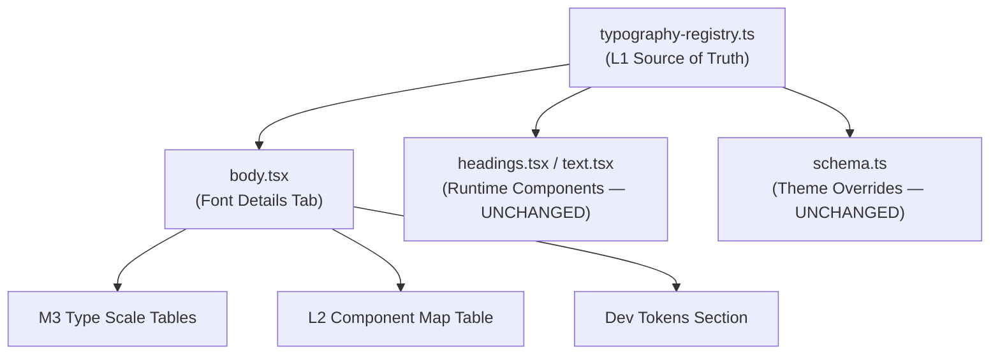

# B.L.A.S.T. EXECUTION PLAN: M3 TYPOGRAPHY ALIGNMENT

**Status:** ACTIVE
**Objective:** Align the Font Details tab (`/debug/metro/typography`) and the underlying typography registry with the Material Design 3 type scale specification. Define all 15 M3 type styles with their 5 required properties, add L2 component mapping, and update the Font Details UI to display the complete spec.

> **DIRECTIVE:** The M3 type scale is the canonical source of truth. ZAP's existing H-series and Body-series tokens are mapped as aliases. No custom "in-between" sizes. The 15-style scale is law.

---

## M3 Type Scale — Source of Truth (Google Fonts / material.io)

| M3 Token          | Role     | Size  | fontSize | fontWeight | lineHeight | letterSpacing | ZAP Font Family |
| :---------------- | :------- | :---- | :------- | :--------- | :--------- | :------------ | :-------------- |
| `displayLarge`    | Display  | Large | 57px     | 400        | 64px       | -0.25px       | primary         |
| `displayMedium`   | Display  | Med   | 45px     | 400        | 52px       | 0px           | primary         |
| `displaySmall`    | Display  | Small | 36px     | 400        | 44px       | 0px           | primary         |
| `headlineLarge`   | Headline | Large | 32px     | 400        | 40px       | 0px           | primary         |
| `headlineMedium`  | Headline | Med   | 28px     | 400        | 36px       | 0px           | primary         |
| `headlineSmall`   | Headline | Small | 24px     | 400        | 32px       | 0px           | primary         |
| `titleLarge`      | Title    | Large | 22px     | 400        | 28px       | 0px           | secondary       |
| `titleMedium`     | Title    | Med   | 16px     | 500        | 24px       | 0.15px        | secondary       |
| `titleSmall`      | Title    | Small | 14px     | 500        | 20px       | 0.1px         | secondary       |
| `bodyLarge`       | Body     | Large | 16px     | 400        | 24px       | 0.5px         | secondary       |
| `bodyMedium`      | Body     | Med   | 14px     | 400        | 20px       | 0.25px        | secondary       |
| `bodySmall`       | Body     | Small | 12px     | 400        | 16px       | 0.4px         | secondary       |
| `labelLarge`      | Label    | Large | 14px     | 500        | 20px       | 0.1px         | secondary       |
| `labelMedium`     | Label    | Med   | 12px     | 500        | 16px       | 0.5px         | secondary       |
| `labelSmall`      | Label    | Small | 11px     | 500        | 16px       | 0.5px         | secondary       |

**Font Family Mapping (ZAP → Google Fonts):**

- `primary` → Bricolage Grotesque / Space Grotesk (Display, Headline)
- `secondary` → Inter (Title, Body, Label)
- `tertiary` → JetBrains Mono (Dev tokens — ZAP extension, outside M3)

---

## L2 Component → Token Mapping

| Component           | M3 Token         | Notes                              |
| :------------------ | :--------------- | :--------------------------------- |
| Hero Title          | `displayLarge`   | Landing/marketing hero sections    |
| Page Title (H1)     | `headlineLarge`  | Single per page                    |
| Section Title (H2)  | `headlineMedium` | Major page divisions               |
| Card Title          | `titleMedium`    | Card/widget headers                |
| Dialog Title        | `titleLarge`     | Modal/dialog headers               |
| Navigation Item     | `labelLarge`     | Sidebar, top nav items             |
| Button Label        | `labelLarge`     | All button text                    |
| Tab Label           | `titleSmall`     | Tab bar items                      |
| Chip Label          | `labelMedium`    | Filter chips, selection chips      |
| Badge               | `labelSmall`     | Status badges, notification dots   |
| Body Text           | `bodyMedium`     | Default paragraph text             |
| Intro Paragraph     | `bodyLarge`      | Lead-in / first paragraph          |
| Caption             | `bodySmall`      | Dates, metadata, secondary info    |
| Input Label         | `bodySmall`      | Form field labels                  |
| Breadcrumb          | `labelMedium`    | Navigation breadcrumbs             |
| Tooltip             | `bodySmall`      | Hover tooltips                     |
| Footer Text         | `bodySmall`      | Footer copy                        |
| Overline / Eyebrow  | `labelSmall`     | Category tags above titles         |

---

## Legacy Token Mapping (ZAP → M3)

| ZAP Token     | M3 Equivalent      | Size Delta | Action                              |
| :------------ | :------------------ | :--------- | :---------------------------------- |
| H1 (48px)     | `headlineLarge` (32px) | -16px   | Document mapping. Components keep ZAP size for now. |
| H2 (38px)     | `headlineMedium` (28px) | -10px  | Same — document only.              |
| H3 (31px)     | `headlineSmall` (24px)  | -7px   | Same.                              |
| H4 (25px)     | `titleLarge` (22px)    | -3px    | Same.                              |
| H5 (20px)     | `titleMedium` (16px)   | -4px    | Same.                              |
| H6 (16px)     | `titleSmall` (14px)    | -2px    | Same.                              |
| body-large    | `bodyLarge` (16px)     | -2px    | Close enough — align later.        |
| body-main     | `bodyMedium` (14px)    | -2px    | Rename candidate.                  |
| body-small    | `bodySmall` (12px)     | 0px     | Already aligned.                   |
| body-tiny     | ❌ No M3 equivalent    | N/A     | Mark as ZAP extension.             |
| Display 1 (95px) | ❌ Exceeds M3 scale | N/A     | Mark as ZAP extension.             |
| Display 2 (76px) | ❌ Exceeds M3 scale | N/A     | Mark as ZAP extension.             |

> [!IMPORTANT]
> This BLAST does NOT change runtime component sizes. It adds the M3 spec as the documented standard in the registry and the Font Details tab. Component migration to M3 values is a separate BLAST.

---

## [B] — Blueprint (What Changes)

### File 1: [typography-registry.ts](file:///Users/zap/Workspace/olympus/packages/zap-design/src/genesis/utilities/typography-registry.ts)

1. **Extend `TypographyTokenMap`** interface with: `m3Role`, `m3Size`, `m3Name`, `fontWeight`, `lineHeight`, `letterSpacing`, `fontFamilyRole`
2. **Add 6 new M3 tokens**: `display-large`, `display-medium`, `display-small`, `label-large`, `label-medium`, `label-small`
3. **Update existing 10 tokens** (h1–h6, body-large/main/small/tiny) with M3 field values
4. **Add `M3_TYPE_SCALE` constant**: ordered array of all 15 M3 tokens for iteration
5. **Add `L2_COMPONENT_MAP` constant**: component → token mapping table
6. **Keep `TYPOGRAPHY_REGISTRY` backward compatible**: existing consumers unaffected

### File 2: [body.tsx](file:///Users/zap/Workspace/olympus/packages/zap-design/src/zap/sections/atoms/typography/body.tsx)

1. **Replace Section 01 (Primary Font)**: Keep font showcase card, render M3 Display + Headline rows with all 5 properties
2. **Replace Section 03 (Heading Standards)**: Becomes unified "M3 Type Scale" with all 15 styles grouped by role
3. **Replace Section 04 (Reading Standards)**: Merged into M3 Type Scale
4. **Add new Section: L2 Component Mapping**: Table showing component → token relationships
5. **Keep Section 05 (Dev Tokens)**: Marked as "ZAP EXTENSION" explicitly
6. **Each token row shows**: M3 name, fontSize, fontWeight, lineHeight, letterSpacing, live sample

---

## [L] — Logic (Execution Rules)

| Rule | Description |
| :--- | :---------- |
| No runtime breakage | `TYPOGRAPHY_REGISTRY` keeps all existing keys. New fields are additive. |
| M3 values are canonical | The registry stores M3's exact values. ZAP overrides (legacy sizes) are documented but separate. |
| All 5 properties per token | Every token MUST define: `fontSize`, `fontWeight`, `lineHeight`, `letterSpacing`, `fontFamilyRole` |
| Dev tokens exempt | `dev-wrapper`, `dev-note`, `dev-metric` are ZAP extensions. They get M3-style fields set to their custom values. |
| Font Details tab = read-only spec | The tab renders from the registry. No hardcoded values in the JSX. |

---

## [A] — Architecture (Integration)

---

## [S] — Styling (Execution Waves)

### WAVE 1: Registry Update (`typography-registry.ts`)

- Extend interface
- Add 6 new M3 tokens with exact Google Fonts values
- Backfill existing 10 tokens with M3 mappings
- Export `M3_TYPE_SCALE` and `L2_COMPONENT_MAP`

### WAVE 2: Font Details Tab Rewrite (`body.tsx`)

- Import `M3_TYPE_SCALE` and `L2_COMPONENT_MAP` from registry
- Build role sections (Display → Headline → Title → Body → Label)
- Each section: role header + token rows with all 5 properties + live font sample
- Add L2 Component Mapping section
- Keep Dev Tokens section with "ZAP EXTENSION" badge
- Keep Primary/Secondary font showcase at top

### WAVE 3: Documentation Update (out of scope for this execution)

- Update `typography-topology.md` to reference M3 tokens
- Update `sop-004` with M3 alignment notes

---

## [T] — Testing (Verification)

1. Run app, navigate to `/debug/metro/typography`, click **FONT DETAILS**
2. **PASS CONDITIONS:**
   - All 15 M3 type styles visible, grouped by role (Display/Headline/Title/Body/Label)
   - Each style shows all 5 properties: fontSize, fontWeight, lineHeight, letterSpacing, fontFamily
   - Each style renders a live sample in the correct font family
   - L2 Component Mapping table visible with ≥15 component entries
   - Dev Tokens section shows with "ZAP EXTENSION" label
   - No TypeScript errors, no broken imports
3. Verify Live Preview and Playground tabs still work unchanged
