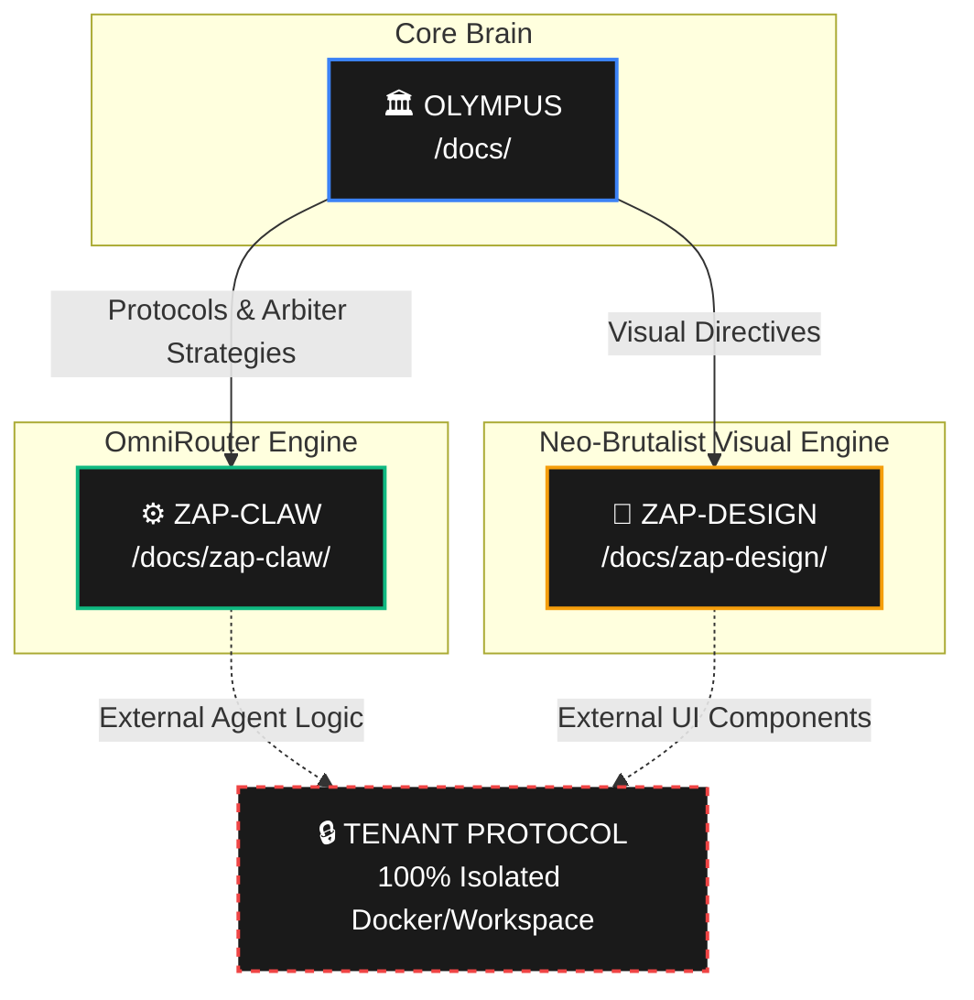

# 🗺️ Cross-Workspace Documentation Map

This Cartesian Map aligns the divided documentation structure across our core micro-workspaces. Use this as your compass when deciding where a feature belongs, or discovering domain-specific protocols.

## 🏛️ OLYMPUS (The Core Brain)

`/Users/zap/Workspace/olympus/docs/`

- **Purpose:** System-wide governance, arbiter strategies, overarching business plans, and overarching AI documentation rules.
- **Master Link:** [master-registry.md](master-registry.md)
- **Notable Locations & Artifacts:**
  - `../.agent/skills/skills-directory.md` -> The global Swarm registry for all ZAP-OS agent capabilities.
  - `docs/sops/` -> Protocols governing team development standardizations (e.g. `sop-014-fleet-arbitrage-protocol.md`).
  - `docs/blast/` -> Current project objectives or massive refactors (e.g. `blast-015-workspace-documentation-standard.md`).

## ⚙️ ZAP-CLAW (The OmniRouter Backend Engine)

`/Users/zap/Workspace/olympus/docs/zap-claw/`

- **Purpose:** Infrastructure decisions, memory swarm configurations, test-time recursive thinking (TRT) deployment architecture, and database logic inside the Node.js/Agent-centric backend.
- **Notable Locations & Artifacts:**
  - `docs/zap-claw/architecture/` -> Detailed systems logic like `gateway-stress-test-matrix.md` and `master-entity-schema.md`.
  - `docs/zap-claw/adr/` -> Architectural Decision Records like `adr-001-caching-strategy.md`.
  - `docs/zap-claw/projects/` -> Deep-dive feature tracking like `prj-001-memory` or `prj-003-olympus-arch`.

## 🎨 ZAP-DESIGN (The Frontend UI / Neo-Brutalist Design System)

`/Users/zap/Workspace/olympus/docs/zap-design/` *(and embedded within `src/`)*

- **Purpose:** The React 19/Next 15 visual engine. Atomic component architecture, Theme Remix definitions, visual primitives, and pixel-pushing design decisions.
- **Notable Locations & Artifacts:**
  - `docs/zap-design/checkpoint-wash-protocol.md` -> Rules surrounding visual checkpoints or resets.
  - `docs/zap-design/spike-jerry-brief.md` / `readme.md` -> Specific agent briefs detailing UI rendering loops.
  - `src/genesis/genesis.md` -> The origin atomic specification for boundaries and tokens.

---

## 🔒 TENANT PORTABILITY RULE (Future Agents)

**IMPORTANT:** The centralisation described above applies strictly to the internal core Olympus/Zap architectural teams. Moving forward, when building customized intelligent agents or workflows *for external customers (Tenants)*, those agents must operate in complete isolation.

All tenant-specific documentation, skills, and configuration files must reside locally within their dedicated Docker volume or independent workspace. This guarantees 100% portability—meaning the tenant's exact configuration can be effortlessly zipped, packaged, and exported to another system without being entangled in the master Olympus documentation pool.

---

*As declared in **blast-015**, remember to strictly adhere to lowercase kebab-case for all files across workspaces.*
