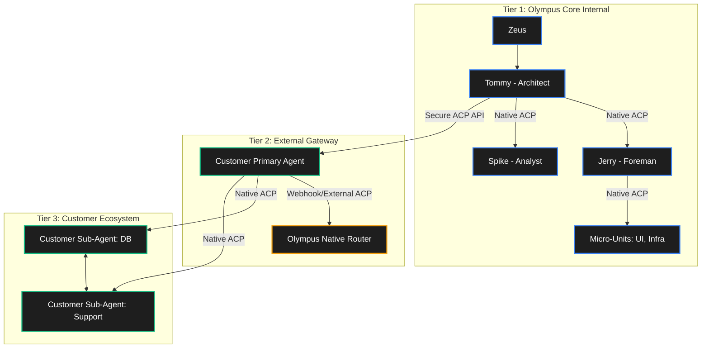

# SOP-018: Native ACP Integration for Agent-to-Agent Communication

**Status:** Active | **Scope:** Global (Olympus & Zap-Claw) | **Date:** 2026-03-06

## 1. Core Philosophy: Why We Are Doing This

Previously, agents communicated using the **Agent-to-Agent (A2A) Ping Protocol (SOP-002)**. While effective, the ATA approach relied on sending compressed JSON pings through human chat platforms (e.g., Telegram, Slack). This generated conversational clutter, caused webhook latency, and polluted the human war rooms with unreadable machine data.

**The Solution: Native ACP (Agent Client Protocol)**
By deploying native ACP extension bridges for our backend sub-agents (e.g., Jerry, Spike), we wire the agents directly into the AI Client's (OpenClaw's) routing gateway via local port-bound WebSockets.

- **Synchronous Interaction:** The primary orchestrator (Tommy) can instantly query and assign tasks to sub-agents.
- **Clean War Rooms:** The heavy data, structural conflicts, and sub-agent communication happen completely in the background. Humans only see the final synthesis, preserving the high signal-to-noise ratio required by the Chief Security Officer (Zeus).
- **Hardened Sandboxing:** Native ACP operates securely at the OS level, bypassing unreliable webhook gateways.

---

## 2. Installation and Architecture

Because the overarching OS-level sandbox natively quarantines global `pnpm` installations (EPERM blocks), the installation procedure for local, untracked ACP extensions uses direct local compilation and symlinking bypasses.

### Step 1: The Code Wrappers

Local extensions are initialized inside `packages/zap-claw/extensions/[agent-name]/index.ts`. These extensions must implement the `AcpRuntime` interface provided by `openclaw/plugin-sdk`. The key function is `runTurn()`, which intercepts the payload and passes it off to the Zap-Claw API processing daemon.

### Step 2: The EPERM Quarantine Bypass

To circumvent the strict macOS/sandbox EPERM file operation locks:

1. Compile the extension code directly into the home configuration directory at `~/.openclaw/extensions/[agent-name]/`.
2. Do **not** use `openclaw plugins install`. Update the `~/.openclaw/openclaw.json` configuration file directly to declare the plugin object:

   ```json
   {
       "id": "zap-[agent-name]",
       "enabled": true
   }
   ```

3. Explicitly enable agent-to-agent operations by setting `tools.sessions.visibility: "all"` and `tools.agentToAgent.enabled: true` in `openclaw.json`.

### Step 3: Launching the Headless Engine

The Native ACP plugins act as routing bridges; they do not hold the memory instance. The actual bot memory instance (the `AgentLoop` for Jerry or Spike) must be active and listening on the designated local webhook port (`8000`).

To boot the daemon while bypassing sandbox root errors, utilize the `zap-run` wrapper from the monorepo root:

```bash
# Starts the background Zap Claw daemon on PORT=8000
./bin/zap-run pnpm --filter zap-claw run daemon
```

---

## 3. Usage Protocols

With the infrastructure complete, primary agents (Tommy) orchestrate sub-agents via standard shell tools:

- **Targeted Firing:** Use the `sessions_send` tool via the payload property `"target": "agent:[agent-name]:main"`.
- **Background Orchestration:**
  Tommy should routinely delegate Olympus monorepo health checks, queue monitoring, and pull request summaries to Jerry (Chief of Staff). Tommy handles the heavy compilation tasks and uses Jerry to maintain awareness of the external environment. Spike (Analyst) is reserved for intensive log debugging.
- **Conflict Handling:** If an ACP connection yields an `ANNOUNCE_SKIP` or the target agent cannot process a structural conflict natively, the primary agent must synthesize a clear `<CONFLICT_REPORT>` and notify `@Zeus` / `@Tom`.

---

## 4. Maintenance: How to Reset or Improve

If the ACP Native bridges ever disconnect, fail, or need refactoring, use this checklist:

### A. Resetting a Dead Connection

1. **Restart OpenClaw Gateway:** Reloading the environment forces it to read the local `~/.openclaw/extensions` files again.
2. **Check the Webhook Daemon:** If the ping succeeds but you get an `ECONNREFUSED` or no response, the Zap-Claw `PORT=8000` daemon has likely crashed silently. Check the node processes for orphaned `tsx watch src/index.ts` zombie background jobs and manually `kill -9` them.
3. **Recompile the Wrapper:** Use `./bin/zap-run pnpm --filter zap-claw run daemon` to safely reboot the runtime.

### B. Future Improvements (Streaming)

Currently, `runTurn()` in the native extensions accepts the message, sends it to `http://127.0.0.1:8000/api/openclaw/inbound`, and immediately yields `{ type: "done" }` to close the loop on Tommy's end. Jerry then processes the text asynchronously through an LLM and fires it to the return webhook.

**V2 Optimization (Synchronous Streaming):** Improve the `runTurn()` method in `index.ts` to implement native long-polling streaming. Instead of yielding early, the function should wait, receive the streaming chunks back from Jerry's HTTP handler, and directly `yield { type: "system", message: chunk }` back up to OpenClaw. This will transform the backend bridge into a completely synchronous, true native ACP runtime hook.

**V3 Optimization (Channel Thread Binding):** Currently, OpenClaw's Telegram channel adapter lacks `subagent_spawning` hooks. This means `thread=true` cannot be used to create persistent, bound conversations when spawning ACP sessions from Telegram.

- **Future Resolution:** Develop or configure the OpenClaw Telegram channel plugin to support `channels.telegram.threadBindings.spawnAcpSessions=true` to allow seamless, persistent sub-agent task routing.

---

## 5. The Olympus Agent Topology (Native ACP Map)

As we build Olympus and integrate Native ACP, our agent ecosystem operates across three distinct tiers of collaboration. This structure ensures internal security while allowing scalable B2B (Business-to-Business) agent interactions via the Native Routing Engine (PRJ-016).

### Tier 1: Internal Construction Agents (The Olympus Core)

These are our proprietary agents (Team Hydra: Tommy, Jerry, Spike, etc.). They exist specifically to build, refine, and secure the ZAP / Olympus platform.
- **Tommy (Architect):** Faces Zeus. High-level planning, PRD generation, architectural decisions.
- **Jerry (Chief of Staff / Foreman):** Sub-agent to Tommy. Handles execution, orchestration, and managing specialized micro-units (UX/UI, Infrastructure).
- **Spike (Analyst):** Sub-agent for deep-dive log analysis and debugging.
- **Communication:** They use Native ACP via local Unix sockets / internal WebSockets to coordinate silently in the background, keeping the human War Room clean.

### Tier 2: External Customer Agents (The Gateway)

When an enterprise customer uses Olympus, they connect their primary agent to our infrastructure.
- **Customer Primary Agent:** Connects to the Olympus routing engine via external Webhooks or external ACP endpoints.
- **Interaction:** Our internal agents (like Tommy or a dedicated support agent) can securely handshake with the Customer Primary Agent to push updates, report statuses, or assist with integration, utilizing strict API boundaries and tenant isolation.

### Tier 3: Customer Sub-Agent Ecosystem

The customer's primary agent manages its own internal swarm.
- **Customer Sub-Agents:** The Customer Primary Agent spawns and orchestrates its own sub-agents (e.g., a Database Agent, a Support Agent) to execute the customer's specific workloads.
- **Routing:** The Olympus Native Routing Engine (PRJ-016) handles the persistence and state management (e.g., `threadId` binding in `SYS_CLAW_sessions`) for these customer sub-agents, allowing them to collaborate seamlessly using Native ACP without bleeding into other tenants.


