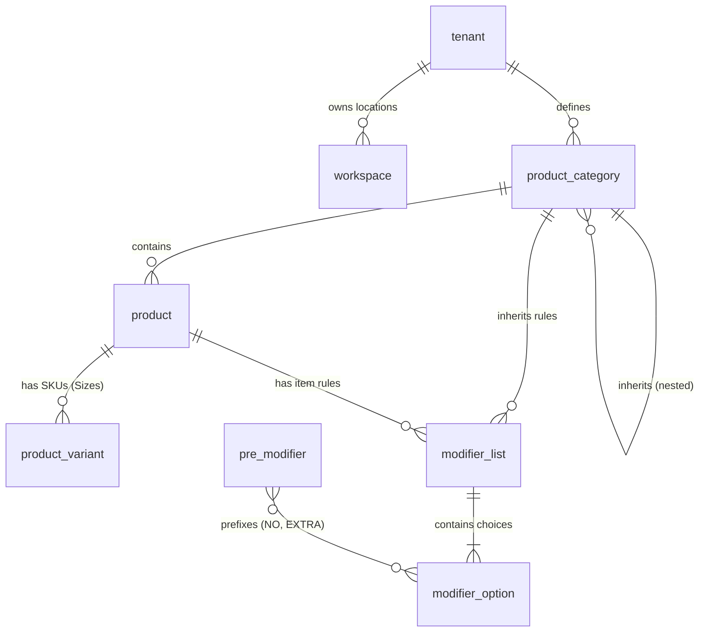

# 1. Architectural Philosophy & Strategy

The ZAP-OS backend relies on two dedicated database engines, each optimized for distinct operational workloads:

1. **MongoDB (The System & AI Brain):** Handles unstructured and heavily nested data like LLM prompts, AI memory, distributed autonomous agent queues, and high-velocity telemetry.
2. **PostgreSQL (The Commerce & F&B Heart):** Handles strict relational commerce logic, financial transactions, multi-channel menus, and inventory routing.

> [!IMPORTANT]
> **The Multi-Tenant Paradigm**
> All data points across *both* database engines are strictly isolated using the explicit `tenant_id` pattern. We do not use dynamic collection names. Everything routes through high-scale generic tables (e.g., `SYS_OS_users` or `workspaces`) and is filtered securely via `tenant_id`.

---

# 2. PostgreSQL Entity Relationship Diagram

This diagram represents the relational core of the Commerce / Food & Beverage module. It strictly enforces parent-child inheritance for menus, pricing, and routing.

---

# 3. Toast POS Parity Mapping

To ensure our system can handle complex F&B operations, our PostgreSQL schema is modeled explicitly against the **Toast Menus API** architecture.

| Toast POS Entity | ZAP-OS PostgreSQL Table | Description |
| :--- | :--- | :--- |
| **Restaurant** | `workspaces` | Physical location endpoints. Binds menus and routing to a physical address. |
| **Menu** | `menu_presentations` | Top-level containers (e.g., "Dinner"). Uses `availability_schedule` for dayparting rules. |
| **MenuGroup** | `product_categories` | Handled via a self-referencing `parent_id` column to natively handle infinite nested category trees. |
| **MenuItem** | `products` | The base sellable entity. Tied to Kitchen display logic via the `prep_station_id` column. |
| **Item Sizes** | `product_variants` | Modeled as explicit SKU Variants (e.g., "Small", "Large") for precise inventory tracking. |
| **MenuOptionGroup** | `modifier_lists` | The rules container. Defines configurations like `min_allowed` and `max_allowed`. |
| **MenuItemOption** | `modifier_options` | The specific upgrade choice. Hands price overrides and can link back to real variants (`linked_variant_id`) for raw ingredient deduction. |
| **DiningOption** | `dining_option` | Column in the `orders` table defining the fulfillment context (For Here, Pickup, Delivery, To Go). Essential for KDS routing and Prep Station logic. |
| **PreModifier** | `pre_modifiers` | Conversational prefixes to cut down database bloat (e.g., "Extra", "No", "Side of"). |
| **PrepStation** | `prep_station_id` | Hardcoded routing ID to determine where a chit prints (Grill, Bar, Expo). |
| **PricingRule** | `pricing_rules` | Dynamic, schedule-based price overrides (e.g., Happy Hour logic). |

---

# 4. MongoDB Multi-Tenant Core (System Data)

System-level data must support 10,000+ merchants without MongoDB collection explosion. These are the finalized, unified generic collections:

* **`SYS_OS_users`**: Global IAM matrix for employees, merchants, and agents.
* **`SYS_OS_settings`**: Global configuration rules applied dynamically across workspaces.
* **`SYS_OS_tasks`**: Autonomous workflow queues used by Agent Swarms.
* **`SYS_OS_memory`**: Long-term unstructured memory banks utilized by the LangChain integration.

---

# 5. Delivery & Dining Options Logistics (From / To Routing)

The `dining_option` dictates the operational lifecycle and physical routing of the order. To scale omnichannel logic (especially for third-party platforms or delivery APIs), we must formally track geographic and physical intention. 

The routing relies strictly on calculating a **From (Origin)** and a **To (Destination)**. 

| Dining Option | Origin (From) | Destination (To) | Logistics & Context |
| :--- | :--- | :--- | :--- |
| **Delivery** | The Restaurant / Store / Warehouse | Customer's Delivery Address | Fulfillment *leaves* the venue to reach the customer's distinct location. Requires driver fleet routing and real-time mapping. |
| **Pickup** | Customer's Current Location (GPS / Mobile Device) | The Restaurant / Store Location | The customer travels from their physical location *to* the venue to retrieve the order. |
| **For Here** | Customer's Current Location (Table QR / Kiosk / Mobile) | The Restaurant / Store Location | Customer is physically present *at* the venue (or traveling explicitly to consume there). Routing targets a specific table or dining area. |
| **To Go** | Customer's Current Location (Counter / Kiosk) | The Restaurant / Store Location | Customer is physically present *at* the venue to retrieve the order and immediately depart. |
