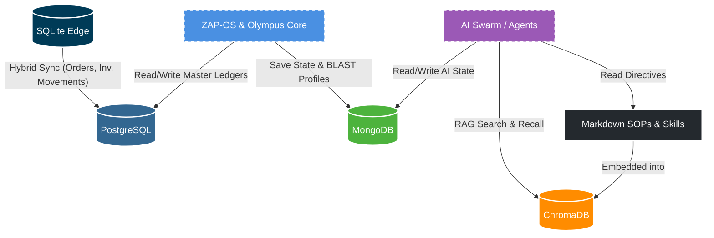
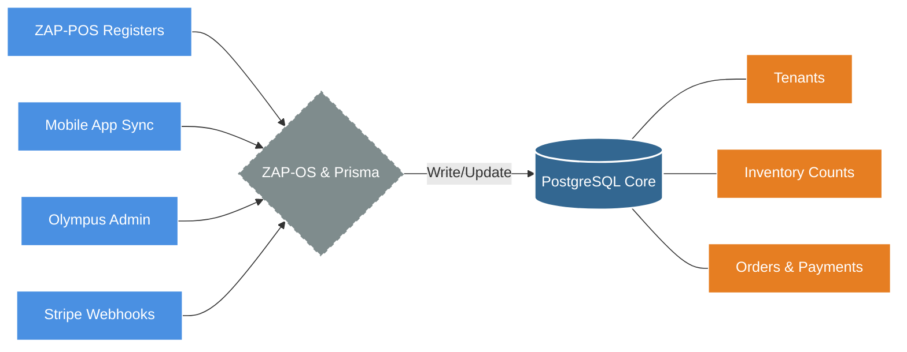
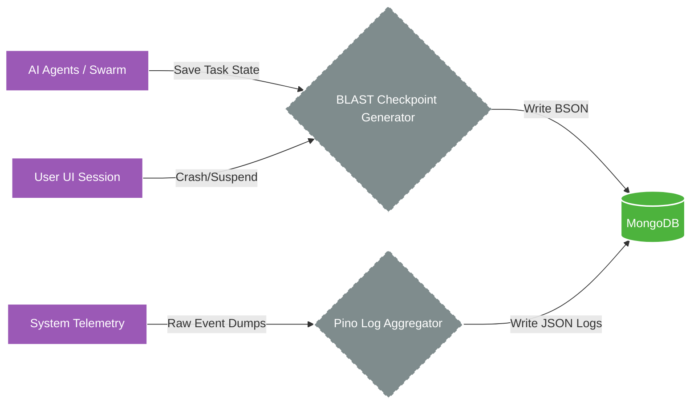
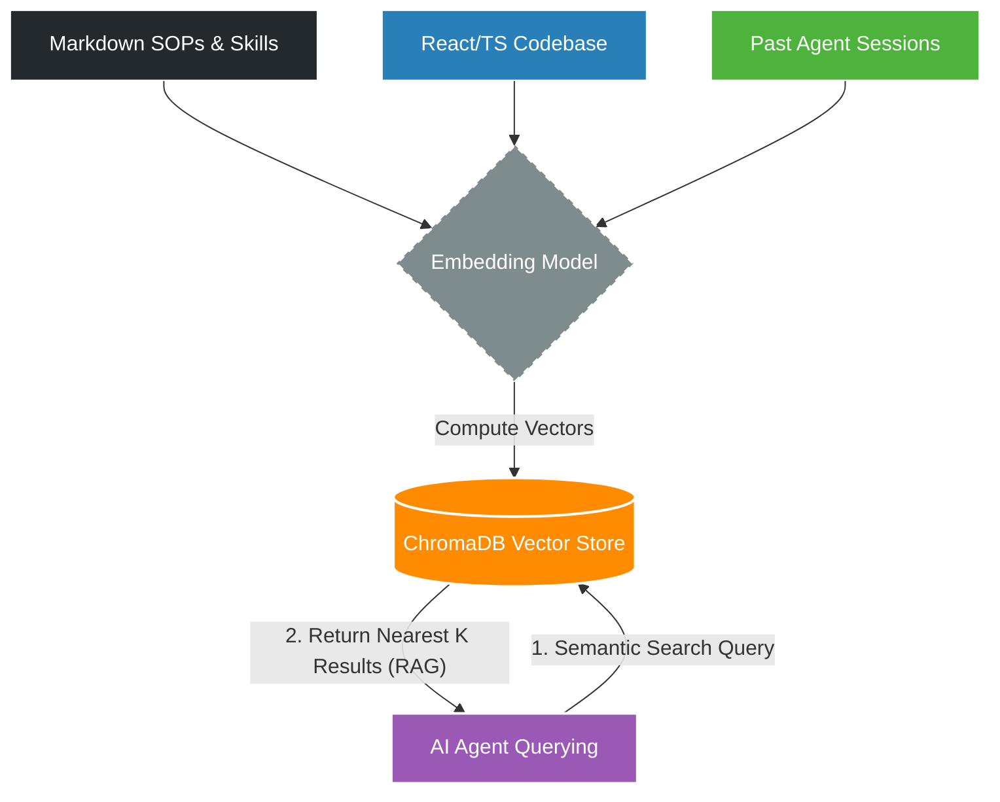
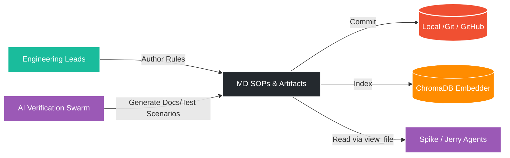
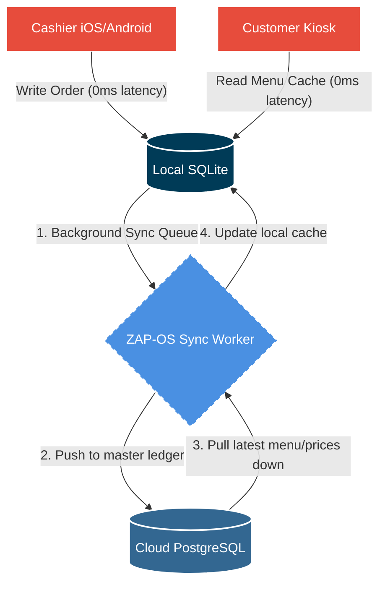

# SOP-034-OLYMPUS-DATA-ARCHITECTURE

**Description:** The authoritative guide on where data lives within the Olympus ecosystem. This document defines the boundaries between relational data, document data, vector embeddings, and plain-text standard operating procedures.

---

## The 5 Pillars of Olympus Data

To prevent monolithic bottlenecks and ensure ZAP-OS scales, we strictly segment our data across four distinct storage paradigms. Every engineer and AI agent (Spike/Jerry) must adhere to these storage locations.

### System Architecture Diagram

---

### 1. PostgreSQL (The Relational Core)

_The source of truth for all transactional, hierarchical, and financial data._

**What lives here:**

- **The Hub (Olympus Core):** Tenants (e.g., Pho24), Billing, Subscriptions, and Platform Staff.
- **ZAP-POS (Sales):** Orders, Items Sold, Payment Transactions.
- **ZAP-HR (Identity):** Merchant Employees, Access Roles, Time Entries.
- **ZAP-OPERATION (Supply Chain):** Products, Variants, Locations, Inventory Ledgers, Purchase Orders.

**The Rule:** If it involves money, strict relationships, or an immutable double-entry ledger, it lives in Postgres.

#### Data Flow

### 2. MongoDB (The Document Object Store)

_The flexible, schema-less store for AI session memory and checkpointing._

**What lives here:**

- **BLAST Summaries:** Serialized session checkpoints generated during active development.
- **AI State:** Complex, deeply nested JSON representations of what the Swarm (Agents) were working on before a crash or handoff.
- **Unstructured Analytics:** High-volume, schemaless web analytics or telemetry dumps that do not require strict joins.

**The Rule:** If it is a deeply nested object, a massive payload of unstructured data, or a save-state for the AI Swarm, it lives in MongoDB.

#### Data Flow

### 3. ChromaDB (The Vector & Memory Vault)

_The mathematical memory layer powering RAG (Retrieval-Augmented Generation) for Spike, Jerry, and the ZAP Swarm._

**What lives here:**

- **Codebase Embeddings:** Mathematical representations of our UI components, API routes, and design system.
- **SOP Vectors:** Embeddings of our operational rules so that the AI can instantly retrieve and apply them during code generation.
- **Contextual Memory:** Semantic search indices allowing the Swarm to recall "How did we implement the Profile Switcher last week?"

**The Rule:** If it requires semantic search or powers the "Brain" of the autonomous agents, it is indexed in ChromaDB.

#### Data Flow

### 4. Markdown Files (.md) (The Source of Truth Directives)

_The human and machine-readable laws of Olympus._

**What lives here:**

- **SOPs (Standard Operating Procedures):** Rules of engagement (e.g., SOP-031 Inventory Tracking, SOP-033 Webhook Integration).
- **Artifacts:** Implementation plans, test scenarios (e.g., `tenant_pho24_test_scenario.md`), and database fracturing schemas.
- **Agent Skills:** The `SKILL.md` files defining exact workflows for the AI.

**The Rule:** If it dictates human processes, architectural law, or AI system prompts, it is written in Markdown and stored in Version Control (Git).

#### Data Flow

### 5. SQLite (The Local Edge)

_The highly-available, localized offline-first database sitting on physical hardware._

**Purpose:** We operate a **Hybrid Model** (Local + Online Sync). By processing writes and reads locally on SQLite, we achieve maximum speed, completely decoupling the real-time store operations from cloud latency.

**What lives here:**

- **ZAP-POS Registers:** Local `orders`, `checkout_sessions`, and cached `products` for zero-latency ringing.
- **Customer Kiosks:** On-device cached menu navigation ensuring ordering never drops on spotty Wi-Fi.
- **Mobile Apps:** Local state and sync queues waiting to beam upward to the Cloud PostgreSQL instance.

**The Rule:** If it lives on a physical iPad, Android terminal, or Customer Kiosk, and requires sub-10ms latency regardless of internet connectivity, you write it to local SQLite first. A background worker will eventually sync it to Olympus Core.

#### Data Flow

