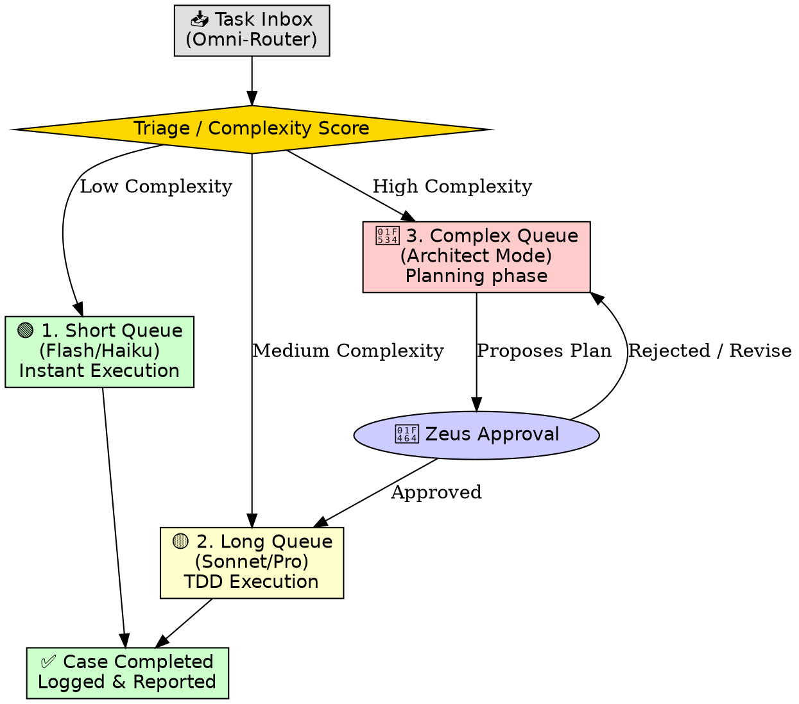

# BLAST-016: Multi-Tier Agent Job Queue Architecture

**Olympus ID:** PRJ-016
**Status:** DRAFT
**Author:** Antigravity / Zeus
**Date:** March 2026

## 1. Executive Summary

To scale agentic output without human bottlenecks, ZAP-OS is implementing a **Multi-Tier Work Queue**. Jobs (cases) arrive from the Master Queue and are automatically routed into specific execution lanes based on their complexity.

This mirrors a standard text/ticket process: You drop a task in the inbox, the router measures it, assigns it to the exact Agent/Model size required, and it executes asynchronously. When the agent finishes, the case is reported back as complete.

## 2. The Three Queue Lanes

### Lane 1: The "Short" Queue (High Velocity, Low Cost)

* **Target:** Simple, fast, deterministic tasks (e.g., formatting data, extracting JSON, basic CSS tweaks).
* **Model:** `gemini-2.5-flash` or `claude-3-haiku`.
* **Behavior:** Agents pull these jobs continuously. They execute instantly and return the payload. No planning required.

### Lane 2: The "Long" Queue (Heavy Execution)

* **Target:** Feature building, writing single UI components, writing standard API routes.
* **Model:** `claude-3.7-sonnet` (Coding) or `gemini-2.5-pro` (Reasoning).
* **Behavior:** These jobs require the agent to hold larger context windows. They execute the Red-Green-Refactor TDD loops autonomously. They report back when the test pipeline passes.

### Lane 3: The "Complex" Queue (The Planning Gate)

* **Target:** Multi-file refactors, new architecture creation, database schema changes.
* **Model:** `gemini-3.1-pro` / `claude-3.7-sonnet`.
* **Behavior:** **BLOCKED BY DEFAULT.** When a task is too complicated, it *cannot* go straight to execution.
    1. The Agent is forced into `PLANNING` mode.
    2. The Agent creates a detailed `[IMPLEMENTATION_PLAN.md]`.
    3. The queue halts and pings Zeus for **Approval**.
    4. ONLY after Zeus approves the plan does the task unblock and drop into the "Long" Queue for execution.

## 3. The Lifecycle of a Case

## 4. Next Steps for Implementation

1. **Queue Data Structure:** We need to build the database schema for the queue (e.g., `ZVN_SYS_OS_job_queue`) storing `status`, `target_lane`, and `assigned_agent`.
2. **The Routing Heuristic:** Define exactly how the Omni-Router determines if a task is "Short," "Long," or "Complex" before it assigns it.
3. **The Approval Webhook:** Build the hook that pauses Complex tasks and pushes the Implementation Plan to Zeus's interface for the manual override.
