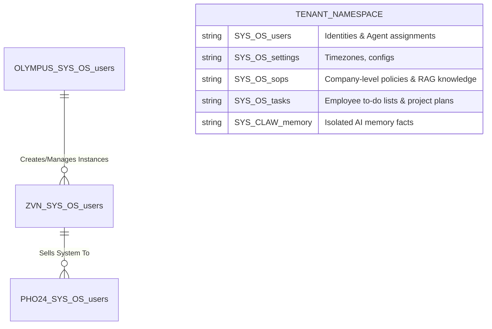
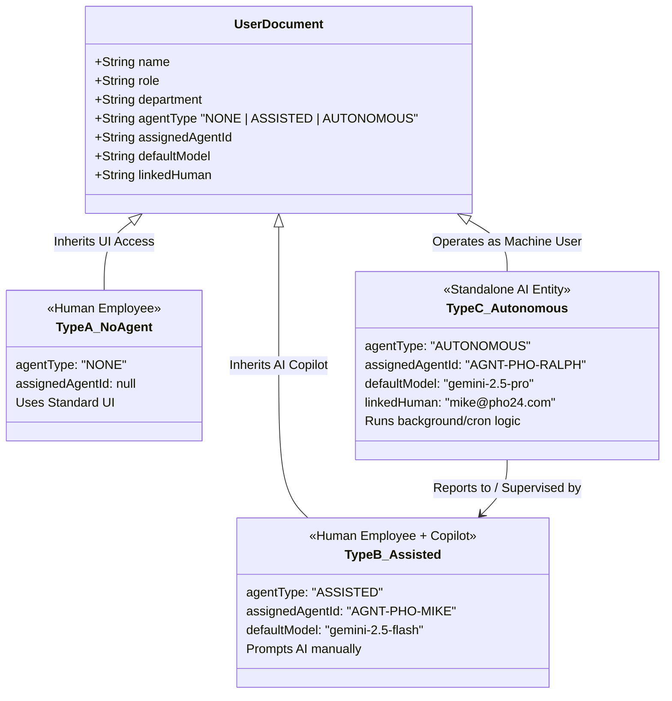
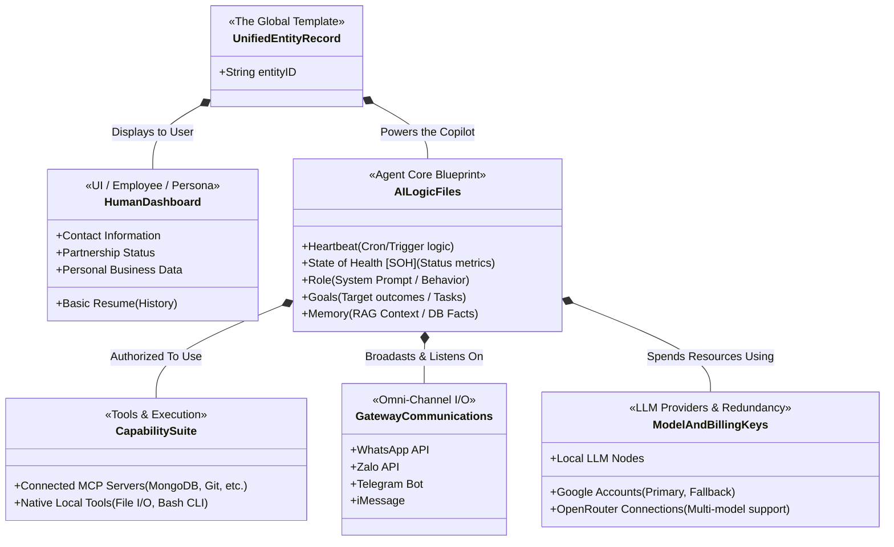

# Olympus Multi-Tenant Database & Agent Relationship Diagram

This document provides a structural layout of how the Olympus system maps Tenants, Human Roles, and the three tiers of AI Agents within MongoDB Atlas.

**SLA ID:** `SLA-arch-20260223`

---

## 1. High-Level Tenant architecture & Core Collections

The Olympus system uses strict collection-level isolation for multi-tenancy. Every tenant has their own isolated collections, prefixed by their `TENANT_ID`.



---

## 2. Infrastructure Build Tracking (The Zeus Override)

While the default rule is strict multi-tenant isolation (e.g., Tom cannot see Dan's tasks), there is a structural exception for system construction.

Because Zeus (`OLYMPUS`) is the God Admin building the underlying system, he requires visibility into the operational progress of the ZAP (`ZVN`) employees executing the build.

```mermaid
flowchart TD
    %% Define Nodes
    SubGraph[Overarching Query View]
    
    Zeus[Zeus (God Admin)\nTenant: OLYMPUS]
    Jerry[Jerry (Chief of Staff AI)\nAGNT-OLY-JERRY]
    
    subgraph Target Data
    OTask[(OLYMPUS_SYS_OS_tasks\nZeus's internal tracker)]
    ZTask[(ZVN_SYS_OS_tasks\nTask lists for Tom, Tommy, Alice, etc.)]
    end
    
    Zeus <-->|Supervises & Directs| Jerry
    
    Zeus -- "Queries Own Tenant" --> OTask
    Zeus -- "Cross-Tenant architecture Override" --> ZTask
    
    Jerry -- "Autonomous God-View Override" --> ZTask
    
    %% Styling
    classDef override fill:#fff3e0,stroke:#e65100,stroke-width:2px;
    classDef ai_god fill:#f3e5f5,stroke:#4a148c,stroke-width:2px;
    class Zeus override;
    class Jerry ai_god;
```

---

## 3. The Agent Typology (Entity-Relationship)

Within any given Tenant's `users` collection (e.g., `PHO24_SYS_OS_users`), employees and AI entities are strictly classified into three types to manage LLM routing and billing.



---

## 3. Real-World Mapping: Pho24 Marketing Department

Here is a practical example of how the data flows within a specific department using the newly designed schemas.

```mermaid
flowchart TD
    %% Define Nodes
    SubGraph[Pho24 Marketing Database Schema]
    
    Dan[Dan (CEO)\nType: ASSISTED\nModel: Pro]
    Mike[Mike (Marketing Manager)\nType: ASSISTED\nModel: Flash]
    Ralph[Ralph (Autonomous Agent)\nType: AUTONOMOUS\nModel: Pro]
    Kevin[Kevin (Junior Staff)\nType: NONE\nModel: N/A]
    
    %% Relationships
    Dan -->|Manages HR/Budget| Mike
    Mike -->|Supervises & Approves Metrics| Ralph
    Ralph -.->|Pulls heavy analytics & balances budgets using gemini-2.5-pro| DB[(MongoDB Atlas)]
    Mike -.->|Chats with AGNT-PHO-MIKE using gemini-2.5-flash| DB
    Kevin -.->|Standard Web Form Entry| DB
    
    %% Styling
    classDef human fill:#e1f5fe,stroke:#01579b,stroke-width:2px;
    classDef autonomous fill:#f3e5f5,stroke:#4a148c,stroke-width:2px;
    classDef noai fill:#eceff1,stroke:#607d8b,stroke-width:2px;
    
    class Dan,Mike human;
    class Ralph autonomous;
    class Kevin noai;
```

### Explanation of the Pho24 Flow:
1.  **Mike (Type B)** logs in and chats with his personal assistant to draft marketing emails fast (`gemini-2.5-flash`).
2.  **Ralph (Type C)** doesn't have a human body. He wakes up every night at 2:00 AM, pulls the daily store revenue, balances the ad budget using complex math (`gemini-2.5-pro`), and leaves a report for Mike to approve the next morning.
3.  **Kevin (Type A)** just clocks in and enters inventory data on a regular screen. He has no AI assigned to him.

---

## 4. The Unified Entity Schematic (Entity Duplication Model)

Every person (and their Assigned AI) or Autonomous Agent is governed by a universal template in the database. Because the structural relationship is identical, we can duplicate this template for every single entity in the system.

A complete **Entity Record** consists of two interconnected halves: The Human Dashboard and the AI Logic Files.



### Schematic Breakdown (OpenClaw Parity)
By mirroring the legacy OpenClaw capability set into a single, structured SQL/Mongo model, whenever a new user or agent is added to the system, this exact complex file structure is cloned and isolated:
1.  **Human Side:** The Dashboard holds all standard operational profiles (who they are, how to contact them, what their business partnerships are).
2.  **AI Side (The Core):** Every AI starts with a blank slate containing a `Heartbeat` signal, internal `SOH` parameters, predefined `Roles`, structured `Goals`, and isolated `Memory`.
3.  **The Extensions:** The AI is then connected natively to specific `Capability Suites` (MCP Tools), multi-platform interaction endpoints like `WhatsApp` and `Zalo`, and is powered by isolated `LLM Keys` so that cost logic is correctly attributed per entity rather than globally.

---

## 5. The Open Claws Execution Pipeline (Gateway & Lane-Based Queuing)

The unified entities defined above do not operate in a vacuum. They are dynamically loaded and executed by the **Open Claws Centralized Gateway**, which serves as the single source of truth for all session state, routing, and concurrency management. This ensures deterministic, safe execution across the entire multi-tenant Olympus platform.

```mermaid
flowchart TD
    %% Gateway I/O
    subgraph OmniChannel ["Omni-Channel I/O"]
        Telegram[Telegram]
        Discord[Discord]
        WhatsApp[WhatsApp API]
        iMessage[iMessage]
        Zalo[Zalo API]
    end

    subgraph TheCentralGateway ["The Centralized Gateway"]
        Gateway[Gateway Core\n(Owns all Session State & Routing)]
        
        %% Queuing System
        subgraph Queuing ["Lane-Based Queuing System"]
            Serial[Serialized Lanes\n(Default: Thread-safe, Strict state)]
            Parallel[Parallel Lanes\n(Low-risk: Cron, SOH, Read-only)]
        end
    end

    subgraph AgentRuntime ["Agent Runtime (Pmono-Based)"]
        Init[Session Initialization\n(Loads Unified Entity Record)]
        Prompter[Dynamic Prompting\n(Injects Tools, Memory, RAG)]
        Loop[Execution Loop\n(LLM API <--> Local Tool Calls)]
        History[Session History Management\n(Pruning & Compaction)]
    end

    %% Flow
    OmniChannel <-->|Streams Results Real-Time| Gateway
    Gateway -->|Routes Request| Serial
    Gateway -.->|Routes Non-Critical| Parallel
    
    Serial --> Init
    Parallel --> Init
    Init --> Prompter --> Loop
    Loop --> History
    History -->|Save & Stream Back| Gateway
    
    %% Styling
    classDef serial fill:#fff3e0,stroke:#e65100,stroke-width:2px;
    classDef parallel fill:#e8f5e9,stroke:#2e7d32,stroke-width:2px;
    classDef core fill:#e3f2fd,stroke:#1565c0,stroke-width:2px;
    
    class Serial serial;
    class Parallel parallel;
    class Gateway core;
```

### Protocol Summary & Benefits:
1.  **Centralized Gateway:** Acts as the isolated arbiter for all incoming signals (WhatsApp, Telegram, etc.) and streams the deterministic results back out to users in real-time.
2.  **Lane-Based Queuing (Determinism & Safety):**
    *   **Serialized Lanes:** The strict default. By isolating sessions in serialized lanes, Open Claws avoids race conditions and async/raise condition bugs, guaranteeing thread-safe execution of user sessions.
    *   **Parallel Lanes:** Explicitly unlocked for lightweight, non-destructive tasks (e.g., cron jobs, internal state-of-health (SOH) pings, read-only analytical queries). This optimizes overall application performance.
3.  **Embedded Agent Runtime:**
    *   Dynamically constructs the system prompt using the Unified Entity's `Role`, `Tools`, and `Memory` blocks.
    *   Runs a local feedback execution loop until the final deterministic answer is reached.
    *   Periodically prunes and compacts the **Session History** to maximize LLM token efficiency without losing critical context.
