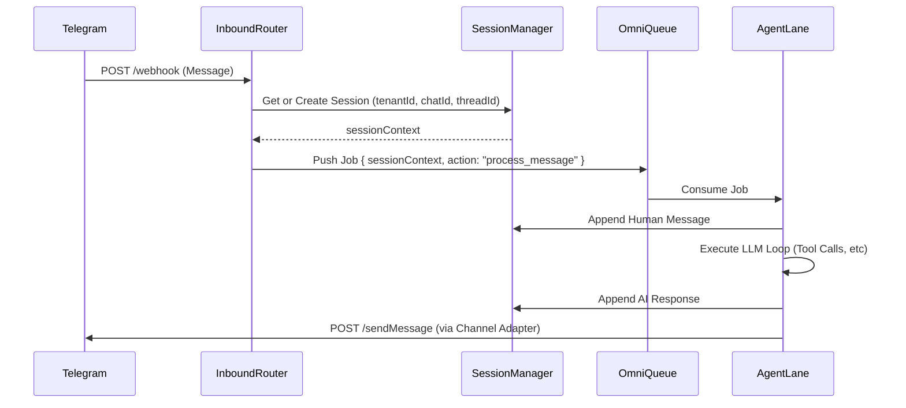

# PRD-005: Olympus Native Routing Engine

**Status:** Approved (`--full-auto` override active) | **Architect:** Tommy | **Date:** 2026-03-06

## 1. Overview

The Olympus Native Routing Engine replaces the external `OpenClaw` dependency for enterprise deployments. It handles incoming webhooks (Telegram, Web), manages per-tenant session memory in MongoDB, and dispatches payloads to the OmniQueue to be processed by ZAP-Claw's Serialized/Parallel lanes.

## 2. Core Components

### 2.1 The Inbound Router (`src/runtime/router/inbound.ts`)

* **Purpose:** Expose scalable webhook endpoints (e.g., `POST /api/webhooks/telegram`).
* **Flow:**
    1. Authenticate the payload (verify webhook signatures).
    2. Extract the `tenantId`, `userId`, `chatId`, and `message`.
    3. Push the raw event onto the localized Redis `OmniQueue`.

### 2.2 The Session Manager (`src/runtime/router/session.ts`)

* **Purpose:** Maintain persistent execution threads, replacing OpenClaw's memory.
* **MongoDB Schema (`SYS_CLAW_sessions`):**
  * `sessionId` (String, Indexed)
  * `tenantId` (String, Indexed) - **Strict Isolation**
  * `channel` (String e.g., 'telegram', 'web')
  * `chatId` (String)
  * `threadId` (String, Optional) - **Solves the `subagent_spawning` limitation.**
  * `messages` (Array) - Context history.
  * `updatedAt` (Date)
* **Compaction Engine:** Integrates with the "Rule of 500" to keep context pruned.

### 2.3 The Channel Adapters (`src/platforms/`)

* **Purpose:** Platform-specific logic for formatting and sending responses back to the user/API.
* **Telegram Adapter (`telegram.ts`):** Must implement native `sendMessage` and `editMessage` utilizing the official `node-telegram-bot-api` or fetch requests, specifically including the `message_thread_id` parameter to support Telegram forum topics and nested agent threads.

### 2.4 The Native ACP Bridge

* Instead of HTTP requests to an external generic OpenClaw server, sub-agents (e.g., Jerry -> Spike) invoke the internal Router directly by passing a `TargetSessionId`.

## 3. Sequence Diagram

## 4. Execution Plan (Handoff to Jerry / Team Hydra)

1. **Unit C (Infrastructure)** will build `src/runtime/router/session.ts` and the exact Mongoose schema for `SYS_CLAW_sessions`.
2. **Unit C** will refactor `src/platforms/telegram.ts` to natively support `threadId`.
3. **Unit C** will build the `inbound.ts` Express/Next.js routes.
